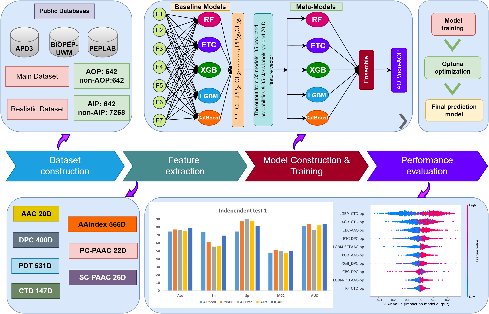

# iAnOxPep: a machine learning model for the identification of anti-oxidative peptides using ensemble learning
## iAnOxPep is an ensemble learning method which is trained on 70-D feature vector for the identification and interpretation of the anti-oxidative peptides. The five conventional classifiers were aggregated together to construct the final predictive model which is named as iAnOxPep. 

